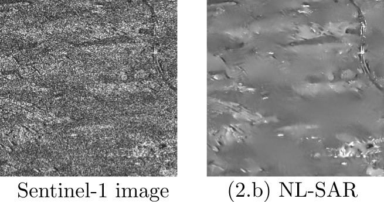
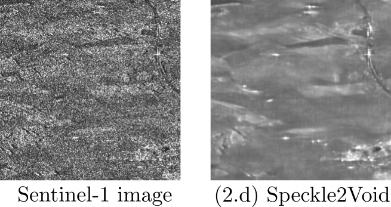

# Toolbox

## SAR Image Despeckling

- SAR-BM3D ([paper](https://ieeexplore.ieee.org/abstract/document/6564458?casa_token=0kPZY3PCIWQAAAAA:zX4dRU97MNB8WZFzbblMyueVn5QoLEgE7poZ4DRfBNCVLCsXjeAAQglwJsZbDDR65Hpqaqf4), [code](http://www.grip.unina.it/web-download.html?dir=JSROOT/SAR-BM3D))
  - Simulated speckle
     
  - Sentinel-1 actual SAR Image
    

- NL-SAR ([paper](https://scholar.google.com/scholar_url?url=https://ieeexplore.ieee.org/iel7/36/4358812/06905794.pdf%3Fcasa_token%3DvWHC9cshbxQAAAAA:cIdkE6aVbxXByga6knKY62NdoCu3t4gmM_6Ti_5v8mtWcWG6ftyHF876bOzfv39Ex3d3Iy4f&hl=fr&sa=T&oi=gsb-gga&ct=res&cd=0&d=16195860779042671272&ei=ZGXMYKSoNYjcmwG-64WICg&scisig=AAGBfm1PseS8p6LGGtv2MxXAw9L16H91cw), [code](https://www.charles-deledalle.fr/pages/nlsar.php))
  - Simulated speckle
     
  - Sentinel-1 actual SAR Image
    

- MuLoG+CNN ([paper1](https://scholar.google.com/scholar_url?url=https://ieeexplore.ieee.org/iel7/83/4358840/07944674.pdf%3Fcasa_token%3DA7u8mWTc7kIAAAAA:WH8ncjT0xu2NCpm7q57acd_Fc1lIBKdSOoajAlESItkSjiIqlFtj1rKXutddOGx22XBVX7Os&hl=fr&sa=T&oi=gsb-gga&ct=res&cd=0&d=6355785246459597091&ei=2WXMYP_wNsvhmQGx5IX4Cw&scisig=AAGBfm2we1Fn87WuVe6wo-XR5_3yfNas6w),[paper2](https://scholar.google.com/scholar_url?url=https://www.mdpi.com/2072-4292/12/16/2636/pdf&hl=fr&sa=T&oi=gsb-gga&ct=res&cd=0&d=15539376496507122988&ei=82XMYLHNGYXSmAGuvJ7YDw&scisig=AAGBfm2htZPDFVoRt29_oIe0NWRPuGQGPw), [code](https://www.charles-deledalle.fr/pages/mulog.php))
  - Simulated speckle
     
  - Sentinel-1 actual SAR Image
    

- Speckle2Void ([paper](https://scholar.google.com/scholar_url?url=https://ieeexplore.ieee.org/iel7/36/4358812/09383788.pdf%3Fcasa_token%3DERkCSfuyRQkAAAAA:yLo4vQurfnYR4VHImwuySazPbVsSAe7MlheWCDqogTUmX5xO1043MT_a9pz8_F01qr-CJF3K&hl=fr&sa=T&oi=gsb-gga&ct=res&cd=0&d=9057156299631691230&ei=fWbMYMWcKM6Fy9YP28-JiAM&scisig=AAGBfm0ei8BVsinYAQsypGbXwB7NGiOwpg), [code](https://github.com/diegovalsesia/speckle2void))
  - Simulated speckle
     
  - Sentinel-1 actual SAR Image
    

- SAR2SAR ([paper](https://scholar.google.com/scholar_url?url=https://ieeexplore.ieee.org/iel7/4609443/9314330/09399231.pdf&hl=fr&sa=T&oi=gsb-gga&ct=res&cd=0&d=9916710335779332870&ei=y2bMYLi-LojcmwG-64WICg&scisig=AAGBfm06WlK7OnvMmzV5w-nPPD5arVSgFg), [code](https://gitlab.telecom-paris.fr/ring/sar2sar))
  - Simulated speckle
     
  - Sentinel-1 actual SAR Image
    

